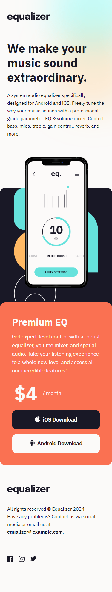
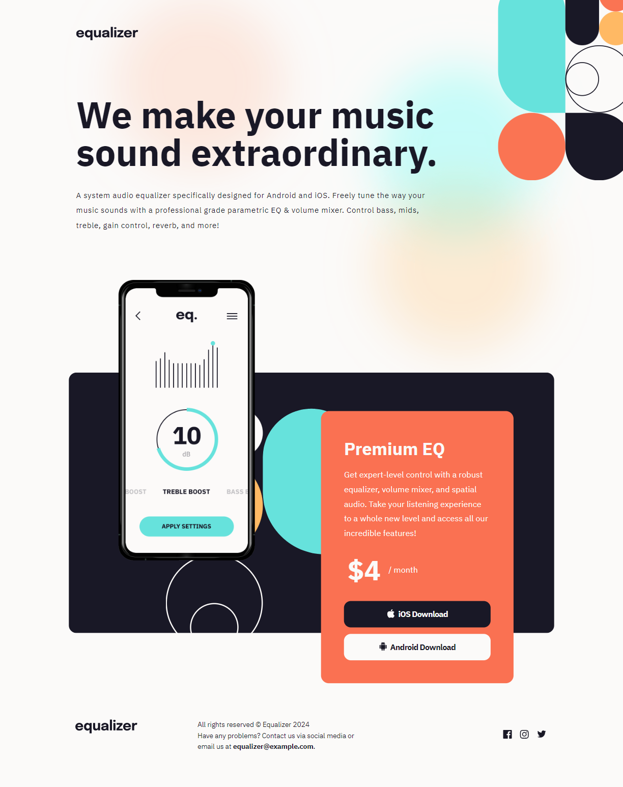

<h1 align="center">Equalizer Landing Page</h1> 

Responsive landing page for an Audio Equalizer app

<table style="">
  <tr>
    <th>Mobile</th>
    <th>Desktop</th>
  </tr>
  <tr>
    <td> 
      
    </td>
    <td>
      
    </td>
  </tr>
</table>

  <h2><a href="https://veraenders.github.io/equalizer-landing-page/">Live</a>
   |  
  <a href="https://github.com/VeraEnders/equalizer-landing-page/">Code</a></h2>
  
This is a solution to the <a href="https://www.frontendmentor.io/challenges/equalizer-landing-page-7VJ4gp3DE">Equalizer landing page</a> on FrontendMentor.

 

## About the project 
This challenge is to build out this landing page and get it looking as close to the design as possible.

Users should be able to:

> View the optimal layout depending on their device's screen size

> See hover states for interactive elements 

## Built with

- Semantic HTML5 markup
- CSS
- Mobile-first workflow

## Author

GitHub - [VeraEnders](https://github.com/VeraEnders)